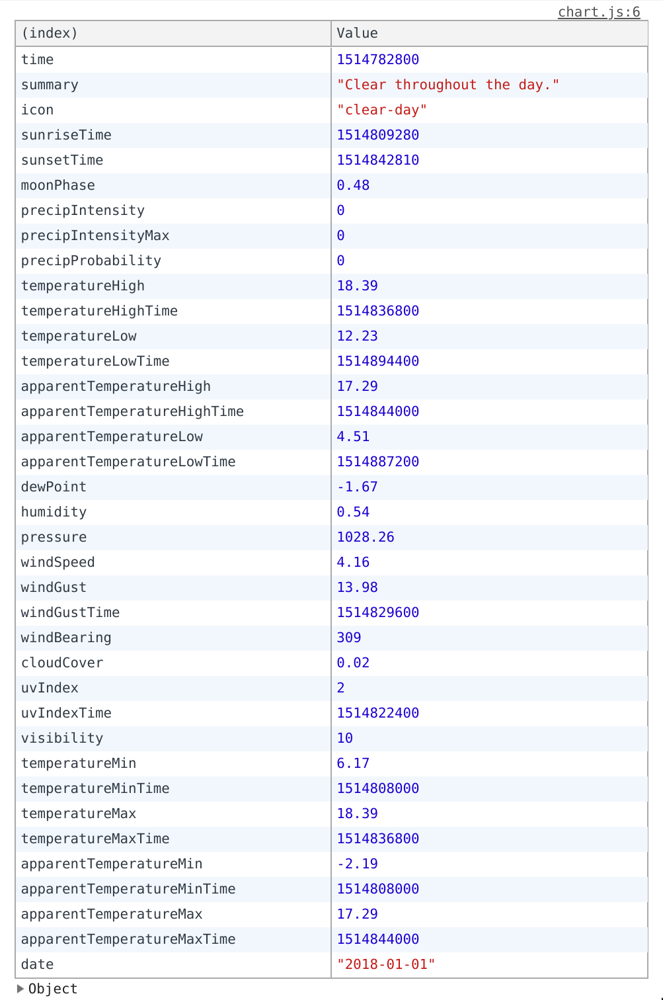

# Loading the weather dataset

<CodeSandboxEmbed
  src="//codesandbox.io/s/gq73t?fontsize=14&hidenavigation=1&theme=dark&autoresize=1&module=/chart.js"
  style={{width: '100%', height: '35em'}}
/>

**The first step to visualizing any dataset is understanding its structure.** To get a good look at our data, we need to import it into our webpage. To do this, we will load the JSON file that holds our data.

D3.js has methods for fetching and parsing files of different formats in the [**d3-fetch**](https://github.com/d3/d3-fetch) module, for example, `d3.csv()`, `d3.json()`, and `d3.xml()`. Since we're working with a JSON file, we want to pass our file path to `d3.json()`.

Let's create a new variable named `dataset` and load it up with the contents of our JSON file.

{lang=javascript,crop-query=.dataset}
<<[code/01-making-your-first-chart/completed/chart.js](./protected/code/01-making-your-first-chart/completed/chart.js)

A>`await` is a JavaScript keyword that will **pause the execution of a function until a Promise is resolved**. This will only work within an async function — note that the `drawLineChart()` function declaration is preceded by the keyword `async`.

A>Don't be overwhelmed by the words **Promise**, **async**, or **await** — this just means that any code (within the function) after `await d3.json("./../../my_weather_data.json")` will wait to run until `dataset` is defined. If you're curious and want to learn more, here is a great resource on [Promises in JavaScript](https://www.youtube.com/watch?v=QO4NXhWo_NM).

T>If you see a `SyntaxError: Unexpected end of JSON input` error message, check your `my_weather_data.json` file. It might be empty or corrupted. If so, re-generate your custom data or copy the `nyc_weather_data.json` file.


# Looking at our data


Going back to our code, let's log our dataset to the console. We can do that by adding the following line of code right after we create our `dataset` file.

```javascript
console.log(dataset)
```

We can see that our dataset is array of objects, with one object per day.

Since each day seems to have the same structure, let's delete the last line and instead log a single data point to get a clearer view.

A>We can use `console.table()` here, which is a great function for looking at array or object values — as long as there aren't too many!

```javascript
console.table(dataset[0])
```

{width=40%}


We have lots of information for each day! We can see metadata (`date`, `time`, `summary`) and details about that day's weather (`cloudCover`, `sunriseTime`, `temperatureMax`, etc). If you want to read more about each metric, check out [The Dark Sky API docs](https://darksky.net/dev/docs#data-point).

### Final code for this lesson

<CodeSandboxEmbed
  src="//codesandbox.io/s/cjm5s?fontsize=14&hidenavigation=1&theme=dark&autoresize=1&module=/chart.js"
  style={{width: '100%', height: '35em'}}
/>