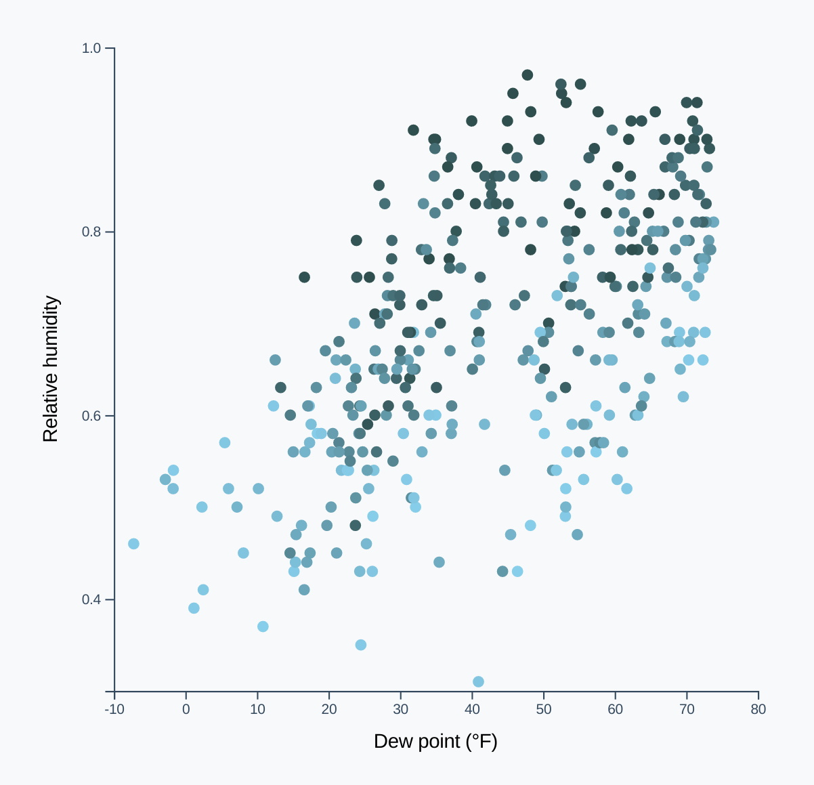

# Extra credit: adding a color scale

<CodeSandboxEmbed
  src="//codesandbox.io/s/722iz?fontsize=14&hidenavigation=1&theme=dark&autoresize=1&module=/chart.js"
  style={{width: '100%', height: '35em'}}
/>

Remember when I said that we could introduce another metric? Let's bring in the amount of cloud cover for each day. In our dataset, each datapoint records the cloud cover for that day. Let's show how the amount of cloud cover varies based on humidity and dew point by adding a color scale.

{width=50%}


Looking at a value in our dataset, we can see that the amount of cloud cover exists at the key `cloudCover`. Let's add another data accessor function near the top of our file:

```javascript
const colorAccessor = d => d.cloudCover
```

Next up, let's create another scale at the bottom of our **Create scales** step.

So far, we've only looked at linear scales that convert numbers to other numbers. Scales can also convert a number into a color — we just need to replace the **domain** with a range of colors.

Let's make low cloud cover days be light blue and very cloudy days dark blue - that's a good semantic mapping.

```javascript
const colorScale = d3.scaleLinear()
    .domain(d3.extent(dataset, colorAccessor))
    .range(["skyblue", "darkslategrey"])
```

Let's test it out - if we log `colorScale(0.1)` to the console, we should see a color value, such as `rgb(126, 193, 219)`. Perfect!

A>Choosing colors is a complicated topic! We'll learn about color spaces, good color scales, and picking colors in **Chapter 7**.

All that's left to do is to update how we set the **fill** of each dot. Let's find where we're doing that now.

```javascript
.attr("fill", "cornflowerblue")
```

Instead of making every dot blue, let's use our `colorAccessor()` to grab the precipitation value, then pass that into our `colorScale()`.

```javascript
.attr("fill", d => colorScale(colorAccessor(d)))
```

When we refresh our webpage, we should see our finished scatter plot with dots of various blues.

{width=50%}


A>For a complete, accessible chart, it would be a good idea to add a legend to explain what our colors mean. We'll skip this for now, to keep things simple.

This chapter was jam-packed with new concepts — we learned about data joins, `<text>` SVG elements, color scales, and more. Give yourself a pat on the back for making it through! Next up, we'll create a bar chart and learn some new concepts.

### Final code for this lesson

<CodeSandboxEmbed
  src="//codesandbox.io/s/6164m?fontsize=14&hidenavigation=1&theme=dark&autoresize=1&module=/chart.js"
  style={{width: '100%', height: '35em'}}
/>