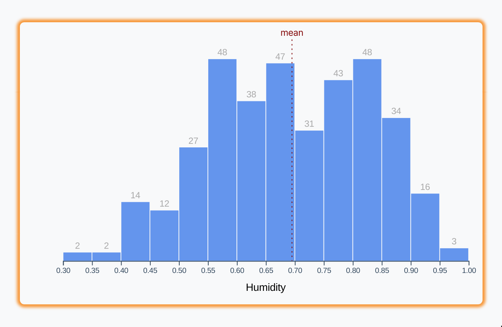

# Accessibility

<CodeSandboxEmbed
  src="//codesandbox.io/s/y1ep6?fontsize=14&hidenavigation=1&theme=dark&autoresize=1&module=/chart.js"
  style={{width: '100%', height: '35em'}}
/>

The main goal of any data visualization is for it to be readable. This generally means that we want our elements to be easy to see, text is large enough to read, colors have enough contrast, etc. But what about users who access web pages through screen readers?

We can actually make our charts accessible at a basic level, without putting a lot of effort in. Let's update our histogram so that it's accessible with a screen reader.

If you want to test this out, download the [ChromeVox](https://chrome.google.com/webstore/detail/chromevox/kgejglhpjiefppelpmljglcjbhoiplfn?hl=en) extension for chrome (or use any other screen reader application). If we test it out on our histogram, you'll notice that it doesn't give much information, other than reading all of the text in our chart. That's not an ideal experience.

The main standard for making websites accessible is from **WAI-ARIA**, the Accessible Rich Internet Applications Suite. WAI-ARIA roles, set using a `role` attribute, tell the screen reader what _type of content_ an element is.

A>We'll be updating our completed _single_ histogram in this section, without the extra credit code.

The first thing we can do is to give our `<svg>` element a `role` of [`figure`](https://developer.mozilla.org/en-US/docs/Web/Accessibility/ARIA/Roles/Figure_Role), to alert it that this element is a chart. (This code can go at the bottom of the **Draw canvas** step).

```javascript
wrapper.attr("role", "figure")
```

Next, we can make our chart _tabbable_, by adding a `tabindex` of `0`. This will make it so that a user can hit `tab` to highlight our chart.

A>There are only two `tabindex` values that you should use:
A>
A>1. `0`, which puts an element in the **tab** flow, in DOM order
A>2. `-1`, which takes an element out of the **tab** flow.

```javascript
wrapper.attr("role", "figure")
    .attr("tabindex", "0")
```

When a user _tabs_ to our chart, we want the screen reader to announce the basic layout so the user knows what they're "looking" at. To do this, we can add a `<title>` SVG component with a short description.


```javascript
wrapper.append("title")
    .text("Histogram looking at the distribution of humidity in 2016")
```

If you have a screen reader set up, you'll notice that it will read our `<title>` when we tab to our chart. The "highlighted" state will look something like this:

{width=75%}


Next, we'll want to make our `binsGroup` selectable by also giving it a `tabindex` of `0`. If the user presses `tab` after the `wrapper` is focused, the browser will focus on the `binsGroup` because it's the next element (in DOM order) that is focusable.

```javascript
const binsGroup = bounds.append("g")
    .attr("tabindex", "0")
```

We can also give our `binsGroup` a `role` of `"list"`, which will make the screen reader announce the number of items within the list. And we'll let the user know _what_ the list contains by adding an `aria-label`.

```javascript
const binsGroup = bounds.append("g")
    .attr("tabindex", "0")
    .attr("role", "list")
    .attr("aria-label", "histogram bars")
```

Now when our `binsGroup` is highlighted, the screen reader will announce: "histogram bars. List with 15 items". Perfect!

Let's annotate each of our "list items". After we create our `binGroups`, we'll add a few attributes to each group:

1. make it focusable with a `tabindex` of `0`
2. give it a `role` of `"listitem"`
3. give it an `area-label` that the screen reader will announce when the item is _focused_.

```javascript
const binGroups = binsGroup.selectAll("g")
  .data(bins)
  .enter().append("g")
    .attr("tabindex", "0")
    .attr("role", "listitem")
    .attr("aria-label", d => `There were ${
      yAccessor(d)
    } days between ${
      d.x0.toString().slice(0, 4)
    } and ${
      d.x1.toString().slice(0, 4)
    } humidity levels.`)
```

Now when we _tab_ out of our `binsGroup`, it will focus the first bar group (and subsequent ones when we **tab**) and announce our aria label.

We'll tackle one last issue — you might have noticed that the screen reader reads each of our x-axis tick labels once it's done reading our `<title>`. This is pretty annoying, and not giving the user much information. Let's prevent that.

At the bottom of our `drawBars()` function, let's select all of the text within our chart and give it an `aria-hidden` attribute of `"true"`.

```javascript
wrapper.selectAll("text")
   .attr("role", "presentation")
   .attr("aria-hidden", "true")
```

Great! Now our screen reader will read only our labels and ignore any `<text>` elements within our chart.

With just a little effort, we've made our chart accessible to any users who access the web through a screen reader. That's wonderful, and more than most online charts can say!

Next up, we'll get fancy with animations and transitions.

### Final code for this lesson

<CodeSandboxEmbed
  src="//codesandbox.io/s/04epy?fontsize=14&hidenavigation=1&theme=dark&autoresize=1&module=/chart.js"
  style={{width: '100%', height: '35em'}}
/>