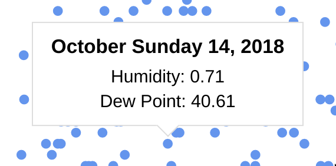
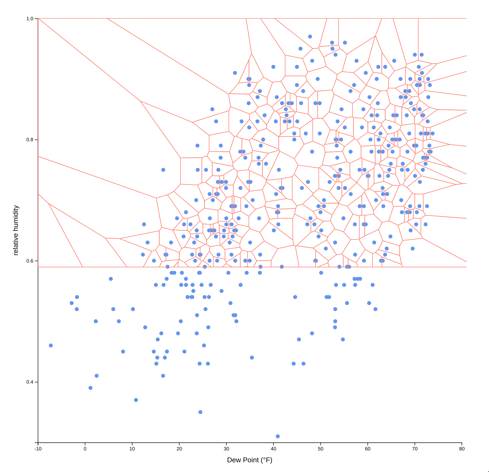
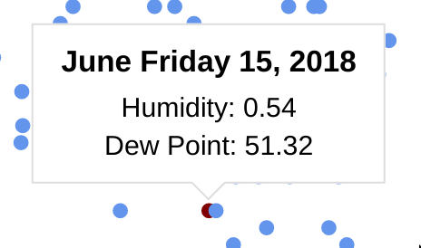
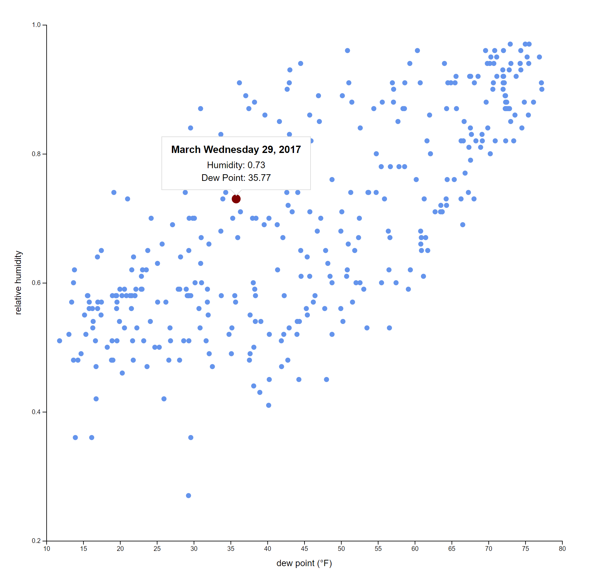

# Scatter plot

Let's level up and add tooltips to a scatter plot.

{width=50%}


We want a tooltip to give us more information when we hover over a point in our chart.

<CodeSandboxEmbed
  src="//codesandbox.io/s/h9uo5?fontsize=14&hidenavigation=1&theme=dark&autoresize=1&module=/chart.js"
  style={{width: '100%', height: '35em'}}
/>

At the bottom of the file, we'll select all of our **`<circle/>`** elements and add a `mousenter` and a `mouseleave` event.

```javascript
bounds.selectAll("circle")
    .on("mouseenter", onMouseEnter)
    .on("mouseleave", onMouseLeave)
```

We know that we'll need to modify our `#tooltip` element, so let's assign that to a variable. Let's also define our `onMouseEnter()` and `onMouseLeave()` functions.

```javascript
const tooltip = d3.select("#tooltip")
function onMouseEnter(event, d) {
}

function onMouseLeave() {
}
```

Let's first fill out our `onMouseEnter()` function. We want to display two values:

- the metric on our x axis (**dew point**), and
- the metric on our y axis (**humidity**).

For both metrics, we'll want to define a string formatter using `d3.format()`. Then we'll use that formatter to set the **text** value of the relevant **`<span/>`** in our tooltip.

```javascript
function onMouseEnter(event, d) {
  const formatHumidity = d3.format(".2f")
  tooltip.select("#humidity")
      .text(formatHumidity(yAccessor(d)))

  const formatDewPoint = d3.format(".2f")
  tooltip.select("#dew-point")
      .text(formatDewPoint(xAccessor(d)))

}
```

Let's add an extra bit of information at the bottom of this function — users will probably want to know the date of the hovered point. Our data point's date is formatted as a string, but not in a very human-readable format (for example, "2019-01-01"). Let's use `d3.timeParse` to turn that string into a date that we can re-format.

```javascript
const dateParser = d3.timeParse("%Y-%m-%d")
console.log(dateParser(d.date))
```

Now we need to turn our date object into a friendlier string. The [**d3-time-format**](https://github.com/d3/d3-time-format) module can help us out here! `d3.timeFormat()` will take a date formatter string and return a formatter function.

The date formatter string uses the same syntax as `d3.timeParse` — it follows four rules:

1. it will return the string verbatim, other than specific directives,
2. these directives contain a percent sign and a letter,
3. usually the letter in a directive has two formats: lowercase (abbreviated) and uppercase (full), and
4. a dash (`-`) between the percent sign and the letter prevents padding of numbers.


For example, `d3.timeFormat("%Y")(new Date())` will return the current year.

Let's learn a few handy directives:

- `%Y`: the full year
- `%y`: the last two digits of the year
- `%m`: the padded month (eg. "01")
- `%-m`: the non-padded month (eg. "1")
- `%B`: the full month name
- `%b`: the abbreviated month name
- `%A`: the full weekday name
- `%a`: the abbreviated weekday name
- `%d`: the day of the month

See the full list of directives at [https://github.com/d3/d3-time-format](https://github.com/d3/d3-time-format).

Now, let's create a formatter string that prints out a friendly date.

```javascript
const dateParser = d3.timeParse("%Y-%m-%d")
const formatDate = d3.timeFormat("%B %A %-d, %Y")
console.log(formatDate(dateParser(d.date)))
```

Much better! Let's plug that in to our tooltip.

```javascript
const dateParser = d3.timeParse("%Y-%m-%d")
const formatDate = d3.timeFormat("%B %A %-d, %Y")
tooltip.select("#date")
    .text(formatDate(dateParser(d.date)))
```

Next, we'll grab the `x` and `y` value of our dot , offset by the **top** and **left** margins.

```javascript
const x = xScale(xAccessor(d))
  + dimensions.margin.left
const y = yScale(yAccessor(d))
  + dimensions.margin.top
```

Just like with our bars, we'll use `calc()` to add these values to the percentage offsets needed to shift the tooltip. Remember, this is necessary so that we're positioning its arrow, not the top left corner.

```javascript
tooltip.style("transform", `translate(`
  + `calc( -50% + ${x}px),`
  + `calc(-100% + ${y}px)`
  + `)`)
```

Lastly, we'll make our tooltip visible and hide it when we mouse out of our dot.

```javascript
  tooltip.style("opacity", 1)
}

function onMouseLeave() {
  tooltip.style("opacity", 0)
}
```

Nice! Adding a tooltip was much faster the second time around, wasn't it?



Those tiny dots are hard to hover over, though. The small hover target makes us focus really hard to move our mouse _exactly_ over a point. To make things worse, our tooltip disappears when moving between points, making the whole interaction a little jerky.

Don't worry! We have a very clever solution to this problem.

### Voronoi

Let's talk briefly about **voronoi diagrams**. For every location on our scatter plot, there is a dot that is the closest. A voronoi diagram partitions a plane into regions based on the closest point. Any location within each of these parts agrees on the closest point.

Voronoi are useful in many fields — from creating art to detecting neuromuscular diseases to developing predictive models for forest fires.

Let's look at what our scatter plot would look like when split up with a voronoi diagram.


See how each point in our scatter plot is inside of a cell? If you chose any location in that cell, that point would be the closest.

There is a voronoi generator built into the main d3 bundle: [`d3-delaunay`](https://github.com/d3/d3-delaunay).

Let's create our own diagram! Let's add some code at the end of the `Draw data` step, right before the `Draw peripherals` step. Instead of creating a voronoi generator, we'll create a new **Delaunay triangulation**. A [delaunay triangulation](https://en.wikipedia.org/wiki/Delaunay_triangulation) is a way to join a set of points to create a triangular mesh. To create this, we can pass [`d3.Delaunay.from()`](https://github.com/d3/d3-delaunay#delaunay_from) three parameters:

1. our dataset,
2. an x accessor function, and
3. a y accessor function.

```javascript
  const delaunay = d3.Delaunay.from(
    dataset,
    d => xScale(xAccessor(d)),
    d => yScale(yAccessor(d)),
  )
```

Now we want to turn our **delaunay triangulation** into a voronoi diagram -- thankfully our triangulation has a `.voronoi()` method.

```javascript
  const voronoi = delaunay.voronoi()
  ```

Let's bind our data and add a `<path>` for each of our data points with a class of "voronoi" (for styling with our `styles.css` file).

```javascript
bounds.selectAll(".voronoi")
  .data(dataset)
  .join("path")
    .attr("class", "voronoi")
```

We can create each path's `d` attribute string by passing `voronoi.renderCell()` the _index of our data point_.

```javascript
bounds.selectAll(".voronoi")
    // ...
    .attr("d", (d,i) => voronoi.renderCell(i))
```

Lastly, let's give our paths a `stroke` value of `salmon` so that we can look at them.

```javascript
bounds.selectAll(".voronoi")
    // ...
    .attr("stroke", "salmon")
```

Now when we refresh our webpage, our scatter plot will be split into voronoi cells!



Hmm, our voronoi diagram is wider and shorter than our chart. This is because it has no concept of the size of our bounds, and is using the default size of `960` pixels wide and `500` pixels tall, which we can see if we log out our `voronoi` object.


Let's specify the size of our diagram by setting our `voronoi`'s `.xmax` and `.ymax` values (before we draw our `<path>`s).

```javascript
const voronoi = delaunay.voronoi()
voronoi.xmax = dimensions.boundedWidth
voronoi.ymax = dimensions.boundedHeight
```

Voila! Now our diagram is the correct size.


What we want is to capture hover events for our paths instead of an individual dot. This will be much easier to interact with because of the contiguous, large hover targets.

Let's remove that last line where we set the `stroke` (`.attr("stroke", "salmon")`) so our voronoi cells are invisible. Next, we'll update our interactions, starting by moving our `mouseenter` and `mouseleave` events from the dots to our voronoi paths.

A>Note that the mouse events on our dots won't be triggered anymore, since they're covered by our voronoi paths.

```javascript
bounds.selectAll(".voronoi")
    // ...
    .on("mouseenter", onMouseEnter)
    .on("mouseleave", onMouseLeave)
```

When we refresh our webpage, notice how much easier it is to target a specific dot!

### Changing the hovered dot's color

Now that we don't need to directly hover over a dot, it can be a bit unclear which dot we're getting data about. Let's make our dot change color and grow on hover.

The naive approach would involve selecting the corresponding **circle** and changing its fill. Note that d3 selection objects have a `.filter()` method that mimics a native Array's.

```javascript
function onMouseEnter(event, d) {
  bounds.selectAll("circle")
    .filter(datum => datum == d)
      .style("fill", "maroon")
```

However, we'll run into an issue here. Remember that SVG elements' z-index is determined by their position in the DOM. We can't change our dots' order easily on hover, so any dot drawn after our hovered dot will obscure it.



Instead, we'll draw a completely new dot which will appear on top.

```javascript
function onMouseEnter(event, d) {
  const dayDot = bounds.append("circle")
      .attr("class", "tooltipDot")
      .attr("cx", xScale(xAccessor(d)))
      .attr("cy", yScale(yAccessor(d)))
      .attr("r", 7)
      .style("fill", "maroon")
      .style("pointer-events", "none")
```

Let's remember to remove this new dot on mouse leave.

```javascript
function onMouseLeave() {
  d3.selectAll(".tooltipDot")
    .remove()
```

Now when we trigger a tooltip, we can see our hovered dot clearly!



Making a tooltip for our scatter plot was tricker than expected, but we saw how important encouraging interaction can be. When our hover targets were small, it felt like work to get more information about a specific point. But now that we're using voronoi cells, interacting with our chart is almost fun!

### Final code for this lesson

<CodeSandboxEmbed
  src="//codesandbox.io/s/4mfxz?fontsize=14&hidenavigation=1&theme=dark&autoresize=1&module=/chart.js"
  style={{width: '100%', height: '35em'}}
/>