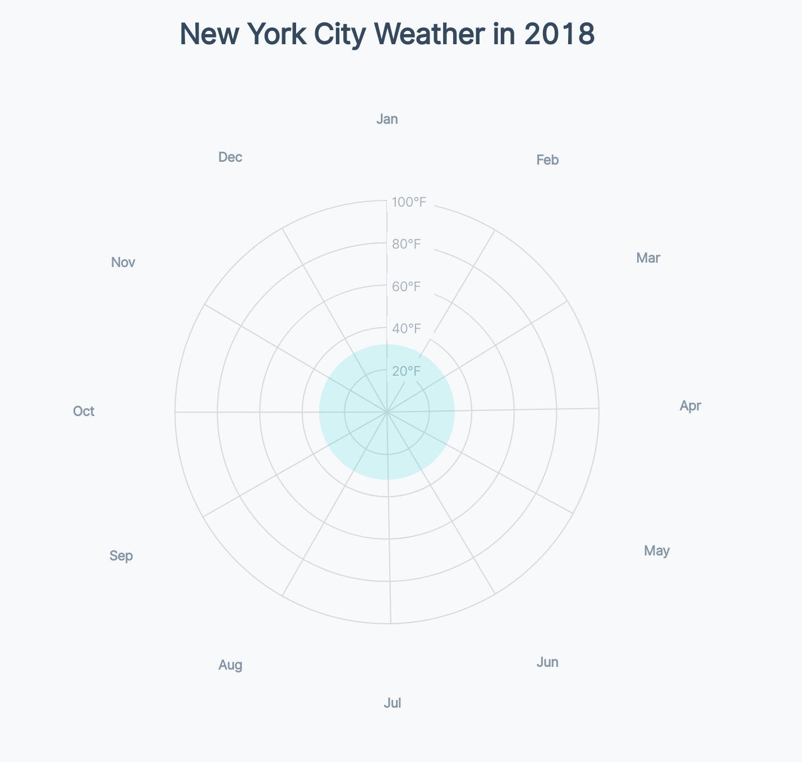

# Adding freezing

<CodeSandboxEmbed
  src="//codesandbox.io/s/f6l77?fontsize=14&hidenavigation=1&theme=dark&autoresize=1&module=/chart.js"
  style={{width: '100%', height: '35em'}}
/>

Let's ease into drawing our data elements by drawing a `<circle>` to show where _freezing_ is on our chart. We'll want to write this code in our **Draw data** step.

We can first check if our temperatures drop low enough:

{lang=javascript,crop-query=.containsFreezing}
<<[code/11-radar-weather-chart/completed/chart.js](./protected/code/11-radar-weather-chart/completed/chart.js)

If our temperatures do drop below freezing, we'll add a `<circle>` whose radius ends at 32 degrees Fahrenheit.

```javascript
if (containsFreezing) {
 const freezingCircle = bounds.append("circle")
   .attr("r", radiusScale(32))
   .attr("class", "freezing-circle")
}
```

Let's set the fill color and opacity of our circle to be a light cyan.

```css
.freezing-circle {
    fill: #00d2d3;
    opacity: 0.15;
}
```

Great! Now we can see where the freezing temperatures will lie on our chart.

{width=75%}


### Final code for this lesson

<CodeSandboxEmbed
  src="//codesandbox.io/s/9xg4m?fontsize=14&hidenavigation=1&theme=dark&autoresize=1&module=/chart.js"
  style={{width: '100%', height: '35em'}}
/>