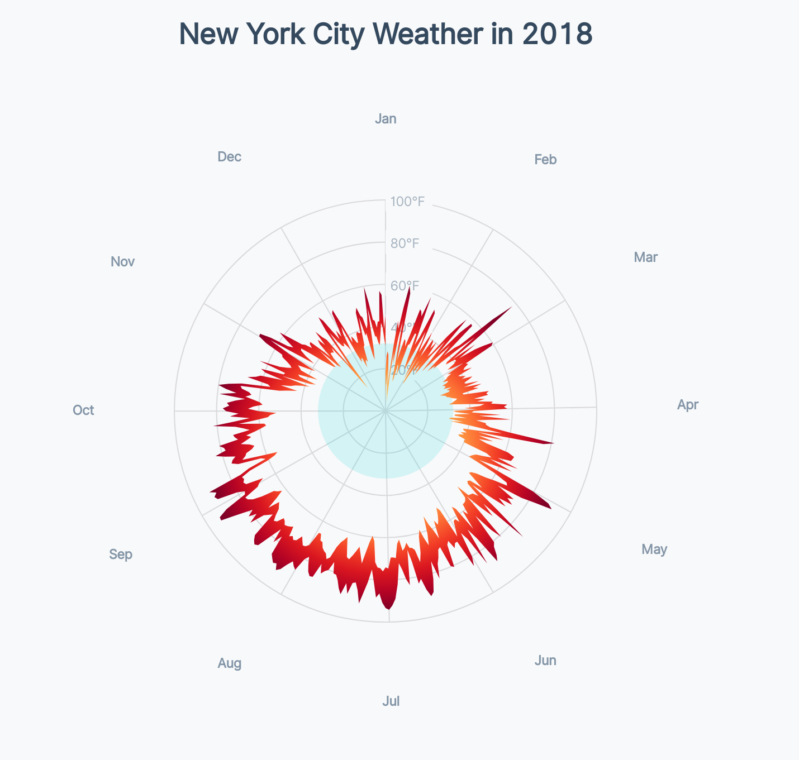

# Adding the temperature area

<CodeSandboxEmbed
  src="//codesandbox.io/s/3cjf4?fontsize=14&hidenavigation=1&theme=dark&autoresize=1&module=/chart.js"
  style={{width: '100%', height: '35em'}}
/>

Our finished chart has a shape that covers the minimum and maximum temperatures for each day. Our first instinct to draw an area is to use `d3.area()`, but `d3.area()` will only take an `x` and a `y` position.

Instead, we want to use [d3.areaRadial()](https://github.com/d3/d3-shape#areaRadial), which is similar to `d3.area()`, but has `.angle()` and `.radius()` methods. Since we want our area to span the minimum and maximum temperature for a day, we can use `.innerRadius()` and `.outerRadius()` instead of one `.radius()`.

{lang=javascript,crop-query=.areaGenerator}
<<[code/11-radar-weather-chart/completed/chart.js](./protected/code/11-radar-weather-chart/completed/chart.js)

Like `.line()` and `.area()` generators, our `areaGenerator()` will return the `d` attribute string for a `<path>` element, given a dataset. Let's create a `<path>` element and set its `d` attribute.

```javascript
const area = bounds.append("path")
   .attr("class", "area")
   .attr("d", areaGenerator(dataset))
```

Perfect! Now our chart is starting to take shape.

{width=75%}


Sometimes displaying a metric in multiple ways can help focus the viewer on it and also give them two ways to encode it. Let's also visualize the temperature with a gradient.

## Drawing a gradient

Let's create a gradient at the end of our **Draw canvas** step.

To make a gradient in SVG, we'll need to create a [`<linearGradient>`](https://developer.mozilla.org/en-US/docs/Web/SVG/Element/linearGradient) or [`<radialGradient>`](https://developer.mozilla.org/en-US/docs/Web/SVG/Element/radialGradient) SVG element.

Within that, we'll create several `<stop>` SVG elements that will tell the gradient what colors to interpolate between, using `stop-color` and `offset` attributes.

For example, this HTML code:

```html
<linearGradient>
    <stop stop-color="#12CBC4" offset="0%"></stop>
    <stop stop-color="#FFC312" offset="50%"></stop>
    <stop stop-color="#B53471" offset="100%"></stop>
</linearGradient>
```

will create this gradient:


> The `offset`'s percentage value is _in proportion to the element using the `<linearGradient>`_.

We'll create our gradient within a `<defs>` element, to keep our code organized so we know where to find re-useable elements. Creating `<defs>` elements near the top helps organize our code -- we'll know where to find elements that are re-useable.

```javascript
const defs = wrapper.append("defs")
```

A `<linearGradient>` is the simplest gradient, but here, we'll want to use a `<radialGradient>`.

{lang=javascript,crop-query=context(.gradientColorScale, 6, 7)}
<<[code/11-radar-weather-chart/completed/chart.js](./protected/code/11-radar-weather-chart/completed/chart.js)

To use a gradient, all we need to do is set the `fill` or `stroke` of a SVG element to `url(#GRADIENT_ID)` (where `GRADIENT_ID` matches the gradient's `id` attribute).

{lang=javascript,crop-query=.area}
<<[code/11-radar-weather-chart/completed/chart.js](./protected/code/11-radar-weather-chart/completed/chart.js)

Great! Now we can see that our gradient re-enforces the relationship between distance from the origin and higher temperatures.

{width=75%}


### Final code for this lesson

<CodeSandboxEmbed
  src="//codesandbox.io/s/8zbkb?fontsize=14&hidenavigation=1&theme=dark&autoresize=1&module=/chart.js"
  style={{width: '100%', height: '35em'}}
/>