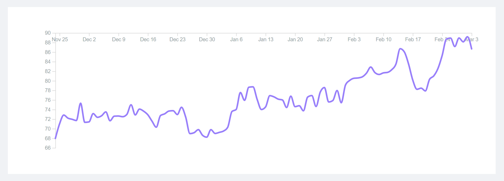
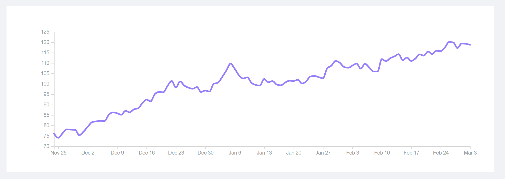

# Drawing our peripherals

<CodeSandboxEmbed
  src="//codesandbox.io/s/fj83b?fontsize=14&hidenavigation=1&theme=dark&autoresize=1&module=/src/Timeline.jsx"
  style={{width: '100%', height: '35em'}}
/>

Next, we want to draw our axes. This is where even experienced d3.js and React.js developers get confused because both libraries want to handle creating new the DOM elements. Up until now, we've used `d3.axisBottom()` and `d3.axisLeft()` to append multiple `<line>` and `<text>` elements to a manually created `<g>`. element. But the core concept of React.js relies on giving it full control over the DOM.

Let's first make a naive attempt at an **Axis** component, mimicking the d3.js code we've written so far. Since our **Axis** component is already imported, we can create a new instance in our render method. We'll need to specify the `dimension` and relevant `scale` of both of our axes.

```javascript
<Axis
  dimension="x"
  scale={xScale}
/>
<Axis
  dimension="y"
  scale={yScale}
/>
```

A>Remember that SVG elements' z-indices are determined by their order in the DOM. If you want your line to overlap your axes, make sure to add the`<Axis>` components before the `<Line>` in your render method.

Let's head over to `src/Chart/Axis-naive.jsx` to flesh out our **Axis** component. There's not much going on here yet, just a basic React Component that accepts a dimension (either **x** or **y**), a scale, and a tick formatting function.

```javascript
const Axis = ({ dimension, scale, ...props }) => {
  return (
    <g {...props}
      className="Axis"
    />
  )
}
```

Let's start by pulling in the dimensions of our chart, using the custom React hook we created earlier.

```javascript
const dimensions = useDimensionsContext()
```

Since we'll want to use `d3.axisBottom()` or `d3.axisLeft()`, based on the `dimension` prop, let's make a map so we can dynamically grab the correct d3 method. This is one of many abstractions that can help to keep our chart library's API simple for collaborators less familiar with d3.

```javascript
const axisGeneratorsByDimension = {
  x: "axisBottom",
  y: "axisLeft",
}
```

Now we can use our mapping to create a new axis generator, based on our `scale` prop.

```javascript
const axisGenerator = d3[axisGeneratorsByDimension[dimension]]()
  .scale(scale)
```

In the past, we've used our axisGenerator on the d3 selection of a newly created `<g>` element. React gives us a way to access DOM nodes created in the render method: **Refs**. To create a React Ref, we create a new variable with `useRef()` and add it as a `ref` attribute to the element we want to target.

```javascript
const ref = useRef()

return (
    <g {...props}
      ref={ref}
    />
)
```

Now when we access `ref.current`, we'll get a reference to the `<g>` DOM node.

Let's transform `ref.current` into a d3 selection by wrapping it with `d3.select()`, then transition our axis in using our `axisGenerator`.

A>Note: we'll have to ensure that `ref.current` exists first, since this code will run before the first render.

```javascript
if (ref.current) {
  d3.select(ref.current)
    .transition()
    .call(axisGenerator)
}
```

Just like that, we have axes! Something is missing though.



Right! We'll need to shift our x axis to the bottom of the chart. Let's add a `transform` attribute to our `<g>` element.

```javascript
<g {...props}
  ref={ref}
  transform={
    dimension == "x"
      ? `translate(0, ${dimensions.boundedHeight})`
      : null
  }
/>
```

Perfect, now that looks like a timeline!



While this way *works*, we'll talk about a preferable method in the next lesson.

### Final code for this lesson

<CodeSandboxEmbed
  src="//codesandbox.io/s/2wlw0?fontsize=14&hidenavigation=1&theme=dark&autoresize=1&module=/src/Chart/Axis-naive.jsx"
  style={{width: '100%', height: '35em'}}
/>